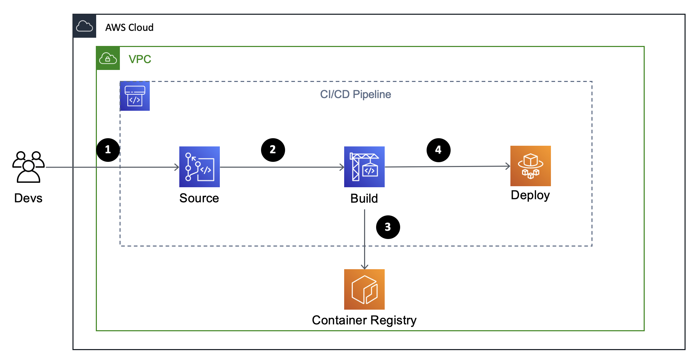
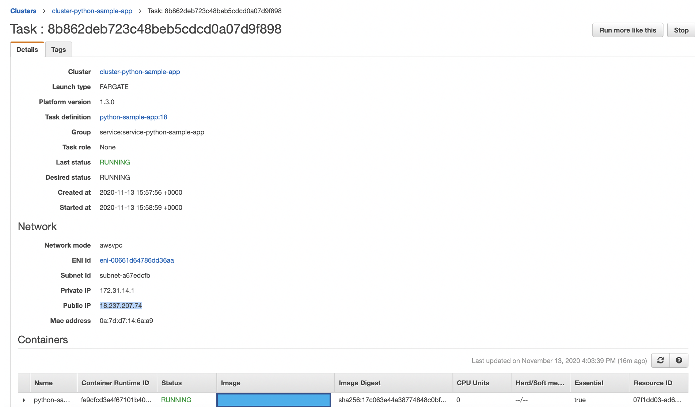

# Amazon ECS Fargate

# Table of Contents

- [Objective](#objective)
- [Diagram](#diagram)
- [Requirements](#requirements)
- [Creation](#creation)
  * [Resources provisioned](#resources-provisioned)
  * [PoC](#poc)
- [Clean Up](#clean-up)

## Objective

Create a `CI/CD` pipeline serverless architecture with `AWS` managed services to deploy a sample `Python` application on `ECS Fargate`

## Diagram



1. Updates are made to the `CodeCommit` repository
2. Automatically triggers the `CodeBuild` project
3. The project creates a `Docker` image in `Elastic Container Registry`
4. After the image is created `CodePipeline` triggers the deploy to `ECS Fargate`

## Requirements

- `AWS CLI` installed: https://docs.aws.amazon.com/cli/latest/userguide/cli-chap-install.html

- Export `AWS ACCESS KEY` and `AWS SECRET KEY` as environment variables:

```bash
export AWS_ACCESS_KEY_ID=
export AWS_SECRET_ACCESS_KEY=
```

- Configure an `SSH key` in your `IAM` credentials:


Edit your SSH configuration file named `config` in your local `~/.ssh` directory. Add the following lines to the file, where the value for User is the SSH Key ID.

```bash
Host git-codecommit.*.amazonaws.com
User Your-IAM-SSH-Key-ID-Here
IdentityFile ~/.ssh/Your-Private-Key-File-Name-Here
```

Once you have saved the file, make sure it has the right permissions by running the following command in the `~/.ssh` directory.

`chmod 600 config`

- `Python` library for AWS: [boto3](https://pypi.org/project/boto3/). It's used to `deregister` the `ECS Task Definitions` due to issues with `Ansible` module here we execute a `python` script to perform this action.

## Creation

- Create the `CI/CD` pipeline with the following command:

`ansible-playbook -i inventory cicd-fargate-pipeline.yml --tags create_fargate`

### Resources provisioned

- `CodeCommit` repository for source code.
- `Elastic Container Registry` for `Docker` images.
- `CodeBuild` project to create the `Docker` image.
- `IAM Roles and Policies` for `CodeBuild`, `CodePipeline`, and `ECS Fargate`.
- `ECS Cluster`, `ECS Service`, and `ECS Fargate Task Definition`.
- `CodePipeline` to orchestrate the pipeline.

### PoC

- Clone the repository with the following command:

`git clone ssh://git-codecommit.us-west-2.amazonaws.com/v1/repos/python-sample-app`

- Copy the `source` code to the cloned repository:

`cp ../python-sample-code/* python-sample-app`

- `Push` the code the the `CodeCommit` repository:

```bash
cd python-sample-app
git add .
git commit -m "initial commit"
git push
```

- Open the `AWS CodePipeline` console to follow the execution steps:

[AWS CodePipeline console](https://us-west-2.console.aws.amazon.com/codesuite/codepipeline/pipelines/python-sample-app-pipeline/view?region=us-west-2)

- At the end of the execution you should see a similar page:


- Open the `AWS ECS` console to retrieve the `public IP` assigned for the `task`: 

**Note:** It's possible to configure an `Application Load Balancer` and use it in conjunction with `ECS` in order to have a static endpoint. In this `PoC` it was not used in order to reduce the costs.

[AWS ECS console](https://us-west-2.console.aws.amazon.com/ecs/home?region=us-west-2#/clusters)



- Copy and paste the IP in the browser using the port `8080` and you should see the `Hello World` message:


## Clean Up

- Destroy the `CI/CD` pipeline with the following command:

`ansible-playbook -i inventory cicd-fargate-pipeline.yml --tags destroy_fargate`
